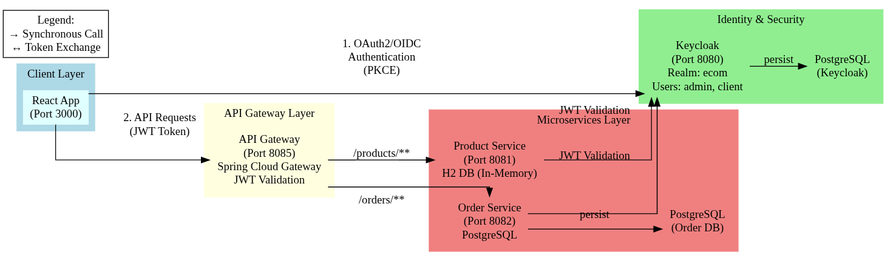
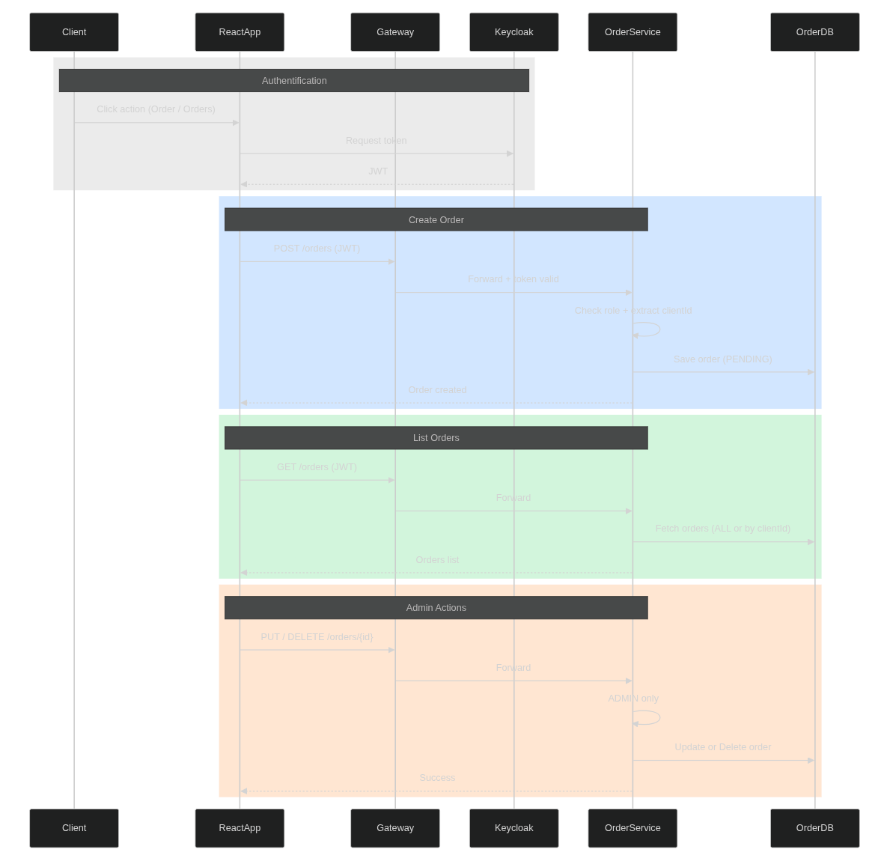

# Projet microservices - Keycloak demo 🚀

Petite introduction
- Ce mini‑projet illustre une application web en architecture micro‑services (React + Spring Boot) sécurisée par Keycloak. L'accent est mis sur la sécurité (OAuth2/OIDC, JWT), la modularité et la conteneurisation.

Sommaire
- [Diagrams](#diagrams)
- [Lancement (Docker Compose)](#lancement-docker-compose)
- [Fonctionnalités implémentées](#fonctionnalites-implmentees)
- [Architecture & composants](#architecture--composants)
- [Tests rapides](#tests-rapides)
- [DevSecOps & logs](#devsecops--logs)
- [Conclusion](#conclusion)

## Diagrams
- Architecture globale  
  

- Architecture du projet (espace de travail local)  
  

- Diagramme de séquence du processus de commande  
  

- Exemple : client ADMIN authentifié et POST/EDIT via Gateway  
  

## Lancement (Docker Compose)
Priorité : utiliser la conteneurisation. Le repo contient un `docker-compose.yml` pour démarrer Keycloak (avec Postgres) et importer le realm `ecom`. Si vous voulez démarrer l'ensemble des services via Docker Compose (si les services sont configurés dans le compose) :
```bash
# démarrer les services et construire les images si nécessaire
docker-compose up -d --build

# suivre les logs (ex : Gateway)
docker-compose logs -f gateway
```

Notes pratiques
- Le compose fourni importe le realm `ecom` automatiquement (fichier `ecom-realm.json`) pour Keycloak.
- Si le docker-compose ne contient que Keycloak/DB, démarrer d'abord Keycloak via compose, puis démarrer les modules (si exécutés localement) :
  - Start Keycloak : `docker-compose up -d`
  - Ensuite lancer les services (dev) si vous préférez en local :
    - Gateway : cd gateway && ./mvnw spring-boot:run
    - Product service : cd product-service && ./mvnw spring-boot:run
    - Order service : cd order-service && ./mvnw spring-boot:run
  (le mode recommandé reste : conteneuriser et ajouter les services au docker-compose)

## Fonctionnalités implémentées
- Frontend React (SPA) authentifié via Keycloak (PKCE pour client public).
- API Gateway (Spring Cloud Gateway) : point d'entrée unique, validation JWT, routage (/products/**, /orders/**).
- Micro-services :
  - Product service (CRUD produits) — endpoints protégés par rôles (ADMIN/CLIENT).
  - Order service (création commandes, vérif. stock, calcul montants).
- Sécurité : Keycloak (realm `ecom`), JWT validés au niveau Gateway et services, rôles ADMIN/CLIENT.
- Bases : en dev, H2 en mémoire par service ; docker-compose prévu pour BDD persistantes (Postgres).
- Conteneurisation : Dockerfile prévus ; docker-compose pour démarrage centralisé.
- DevSecOps : workflows (CodeQL, Semgrep, ESLint, OWASP Dependency-Check, Trivy) inclus.

## Architecture & composants
- Frontend : react-app (communique uniquement via Gateway).
- Gateway : spring cloud gateway (port par défaut du repo : 8085).
- Product service : spring-boot (port 8081).
- Order service : spring-boot (port 8082).
- Auth : Keycloak (http://127.0.0.1:8080, realm `ecom`).

## Tests rapides
- Obtenir un token via le frontend (ou via Keycloak REST) puis :
```bash
# lister produits via Gateway
curl -H "Authorization: Bearer <ACCESS_TOKEN>" http://127.0.0.1:8085/products

# créer produit (ADMIN)
curl -X POST -H "Content-Type: application/json" -H "Authorization: Bearer <ACCESS_TOKEN>" \
  -d '{"name":"Nom","description":"Desc","price":12.5,"quantity":10}' \
  http://127.0.0.1:8085/products
```

## DevSecOps & logs
- Scans automatisés configurés dans les workflows GitHub Actions (CodeQL, Semgrep, Trivy, Dependency-Check).
- Logs applicatifs via Spring Boot : inclure identification utilisateur (extraction du token) pour traçabilité.

## Conclusion
- L'implémentation fournie couvre les points essentiels du cahier des charges : front sécurisé, gateway centralisée, micro-services séparés, conteneurisation et pipelines DevSecOps.
- Propositions d'extensions : déploiement Kubernetes, mTLS, circuit breaker, tests automatisés, monitoring avancé.

---

## 🧰 Prérequis
- Java 21, Maven
- Node.js + npm
- Docker & Docker Compose (recommandé pour lancer Keycloak)
- Ou Keycloak installé localement

---

## 🐳 Démarrage rapide avec Docker Compose (Recommandé)
Le projet inclut un fichier `docker-compose.yml` qui démarre automatiquement Keycloak avec PostgreSQL et importe le realm `ecom`.

1. **Démarrer Keycloak avec Docker Compose** :
```bash
docker-compose up -d
```

2. **Vérifier que les services sont démarrés** :
```bash
docker-compose ps
```

3. **Accéder à Keycloak** :
   - URL : http://localhost:8080
   - Admin username : `admin`
   - Admin password : `admin`
   - Le realm `ecom` est importé automatiquement !

4. **Arrêter les services** :
```bash
docker-compose down
```

5. **Arrêter et supprimer les volumes (données)** :
```bash
docker-compose down -v
```

**Note** : Le fichier `docker-compose.yml` inclut :
- **PostgreSQL** : Base de données pour Keycloak (persistance)
- **Keycloak** : Import automatique du realm `ecom` depuis `ecom-realm.json`
- Health checks pour s'assurer que les services sont prêts

---

## 🔐 Keycloak — exporter / importer le realm (Manuel)
Pour faciliter la configuration de votre environnement, un export du realm `ecom` est fourni (fichier `ecom-realm.json`).

- Import via l'interface Keycloak (si vous n'utilisez pas Docker Compose) : Realm → **Add realm** → **Select file** → Import `ecom-realm.json`.

- Remarques importantes :
  - **Ne publiez pas** de secrets (client secrets, mots de passe) dans un dépôt public. Si vous placez `ecom-realm.json` dans Git, redactionnez ou stockez le fichier dans un privé.
  - Vérifiez après import : clients `ecom-frontend` (public) et `ecom-backend` (confidential), rôles `ADMIN` et `CLIENT`, utilisateurs (`admin`, `client`) et leurs affectations.

---

## ▶️ Lancer les services (dev, chacun dans son terminal)
Note : si `./mvnw` renvoie `Permission denied`, exécutez `chmod +x mvnw` dans chaque module.

- Gateway (port 8085)
```bash
cd gateway && ./mvnw spring-boot:run
```

- Product service (port 8081)
```bash
cd product-service && ./mvnw spring-boot:run
```

- Order service (port 8082)
```bash
cd order-service && ./mvnw spring-boot:run
```

- Frontend React (port 3000)
```bash
cd react-app
npm ci
npm start
```

---

## ✅ Points utiles / URLs
- Frontend : http://127.0.0.1:3000
- Gateway : http://127.0.0.1:8085
  - Routes : `/products/**` -> product service, `/orders/**` -> order service
- Product service H2 console : http://127.0.0.1:8081/h2-console (JDBC URL: `jdbc:h2:mem:productdb`)
- Keycloak (admin) : http://127.0.0.1:8080 (realm `ecom`)

---

## 🧪 Tests rapides (après login via le frontend)
- Obtenir un token : connectez-vous dans le navigateur via le frontend et copiez l'Access Token depuis `keycloak.token` dans la console JavaScript (ou utilisez la REST API pour obtenir un token).

- Exemple : lister produits (via Gateway)
```bash
curl -H "Authorization: Bearer <ACCESS_TOKEN>" http://127.0.0.1:8085/products
```

- Exemple : créer produit (ADMIN)
```bash
curl -X POST -H "Content-Type: application/json" -H "Authorization: Bearer <ACCESS_TOKEN>" \
  -d '{"name":"Nom","description":"Desc","price":12.5,"quantity":10}' \
  http://127.0.0.1:8085/products
```

---

## 🔒 Règles de sécurité
- Le Gateway valide les JWT et centralise la sécurité. Les micro-services vérifient également les rôles (ADMIN/CLIENT).
- Frontend : **ecom-frontend** (client public) utilise PKCE (Standard Flow).
- Backend : **ecom-backend** (confidential) pour usage côté serveur si nécessaire.

---

## 🐞 Dépannage rapide
- Erreur *Invalid parameter: redirect_uri* → vérifier que `Valid Redirect URIs` & `Web Origins` du client frontend contiennent `http://127.0.0.1:3000/*` et `http://127.0.0.1:3000`.
- React : si `react-scripts: Permission denied` → `rm -rf node_modules && npm ci` puis `chmod +x node_modules/.bin/react-scripts` si nécessaire.
- 403 sur API → vérifiez que le token contient `realm_access.roles` et que l’utilisateur a le rôle attendu.

---

## 🛡️ Sécurité & Analyse de Code

Ce projet inclut un workflow GitHub Actions complet pour l'analyse de sécurité :

### 🔍 Outils Intégrés

1. **CodeQL** - Analyse statique native GitHub (SAST)
   - Détection de vulnérabilités de sécurité dans Java et JavaScript
   - Analyse sémantique avancée du code
   - Intégration native avec GitHub Security tab
   - Pas de configuration serveur nécessaire

2. **Semgrep** - Analyse SAST moderne et rapide
   - Détection de patterns de sécurité dangereux
   - Règles pré-configurées pour OWASP Top 10
   - Support Java, JavaScript, React, Docker
   - Résultats en temps réel

3. **ESLint** - Analyse de code JavaScript/React
   - Détection de problèmes de qualité et sécurité
   - Règles spécifiques à React
   - Analyse statique du code frontend

4. **OWASP Dependency-Check** - Analyse des dépendances
   - Détection de CVEs dans les dépendances Maven et npm
   - Génération de rapports SARIF pour GitHub Security
   - Seuil configurable (CVSS ≥ 7 par défaut)

5. **Trivy** - Scan des images Docker
   - Analyse des vulnérabilités dans les images Docker
   - Détection des failles OS et applicatives
   - Rapports pour chaque service (gateway, product, order, react-app)

### 📖 Documentation

- **[Guide de Configuration](SECURITY_WORKFLOW_SETUP.md)** - Configuration complète et premiers pas
- **[Référence Rapide](SECURITY_QUICK_REFERENCE.md)** - Commandes et aide-mémoire
- **[Documentation Workflow](.github/workflows/README.md)** - Détails techniques du workflow

### 🚀 Démarrage Rapide

1. **Aucune configuration serveur nécessaire !** 
   - CodeQL, Semgrep et ESLint fonctionnent directement dans GitHub Actions
   - Pas besoin de SONAR_TOKEN ou SONAR_HOST_URL

2. Le workflow s'exécute automatiquement sur :
   - Push vers `main`, `master`, ou `develop`
   - Pull Requests
   - Planification hebdomadaire (lundi 00:00 UTC)
   - Déclenchement manuel

3. Consultez les résultats :
   - **GitHub Security Tab** : Alertes CodeQL, Semgrep, OWASP et Trivy
   - **Code Scanning Alerts** : Vulnérabilités détaillées avec suggestions de correction
   - **Workflow Artifacts** : Rapports détaillés HTML/JSON

### ✨ Avantages des Nouveaux Outils

- ✅ **Zéro Configuration** - Pas de serveur SonarQube à configurer
- ✅ **Gratuit pour Projets Publics** - Tous les outils sont gratuits sur GitHub
- ✅ **Intégration Native** - Résultats directement dans GitHub Security
- ✅ **Analyse Rapide** - Résultats en quelques minutes
- ✅ **Suggestions de Correction** - CodeQL fournit des exemples de code corrigé

Pour plus d'informations, consultez le [guide de configuration complet](SECURITY_WORKFLOW_SETUP.md).

---

## 📚 Contribuer
- Ajoutez issues/PR pour les nouvelles fonctionnalités (Orders UI, tests, Docker compose, CI/CD, sécurité scans).
- Assurez-vous que tous les tests de sécurité passent avant de soumettre une PR.
- Documentez toute suppression de vulnérabilité dans les fichiers de configuration appropriés.

---

## Documentation technique (conforme au cahier des charges)

Objectif
- Concevoir une application web moderne en architecture micro-services sécurisée pour la gestion des produits et commandes. L'implémentation fournie suit les standards : OAuth2/OpenID Connect, Gateway centralisée, conteneurisation et pipelines DevSecOps.

Architecture générale (état)
- Frontend : React (SPA) — implémenté.
- API Gateway : Spring Cloud Gateway (point d'entrée unique, validation JWT, routage) — implémenté.
- Micro-services : Product (port 8081) et Order (port 8082) — Spring Boot indépendants — implémentés.
- Auth : Keycloak (realm `ecom`) — fourni via docker-compose / ecom-realm.json — implémenté.
- Bases de données : bases séparées (en dev : H2 en mémoire). Chaque micro-service gère sa propre BDD — implémenté.

Architecture visuelle


1) Frontend Web (React)
- Authentification : Keycloak (OAuth2 / OIDC) avec PKCE pour le client public `ecom-frontend`.
- Session : gestion via tokens JWT fournis par Keycloak (utilisés pour les appels API vers la Gateway).
- Fonctionnalités : affichage catalogue, création/consultation de commandes, interface adaptée selon rôle (ADMIN / CLIENT).
- Communication : toutes les requêtes passent par l'API Gateway (pas d'accès direct aux micro-services).
- Gestion d'erreurs : 401/403 gérés côté client (redirection / message).

2) Micro-service Produit (Product service)
- Endpoints CRUD :
  - POST /products (ADMIN)
  - PUT /products/{id} (ADMIN)
  - DELETE /products/{id} (ADMIN)
  - GET /products (ADMIN, CLIENT)
  - GET /products/{id} (ADMIN, CLIENT)
- Modèle produit : id, name, description, price, quantity.
- Persistance : H2 en mémoire (dev); Dockerfile et config prêts pour PostgreSQL si souhaité.

3) Micro-service Commande (Order service)
- Endpoints :
  - POST /orders (CLIENT) — création de commande (vérification stock).
  - GET /orders (ADMIN) — lister toutes les commandes.
  - GET /orders/my (CLIENT) — consulter ses commandes.
- Logique : calcul automatique du montant total, vérification disponibilité via appel REST vers Product service.
- Format ligne commande : { idProduit, quantité, prix }.

4) Communication inter-services
- Appels REST entre Order -> Product pour vérification stock et récupération prix.
- Propagation du token JWT lors des appels inter-services (Gateway / services configurés pour forward).
- Gestion des erreurs métiers (produit inexistant, stock insuffisant) renvoyées avec codes HTTP appropriés.

5) Sécurité (Keycloak)
- Keycloak assure authentification et autorisation.
- Tokens JWT validés au niveau du Gateway et au niveau des micro-services.
- Rôles utilisés : ADMIN, CLIENT.
- Configuration : realm `ecom`, clients `ecom-frontend` (public) et `ecom-backend` (confidential).

6) API Gateway
- Point d'entrée unique pour le frontend (routes /products/**, /orders/**).
- Validation JWT centralisée, routage, et règles d'autorisation. Aucune logique métier dans la gateway.

7) Gestion des données
- Une BDD par micro-service (principe micro-services respecté).
- En dev, H2 en mémoire ; Docker Compose prévu pour base persistante (Postgres) si activée.

8) Conteneurisation
- Dockerfile présent pour chaque composant (frontend, gateway, product-service, order-service).
- docker-compose.yml fourni pour démarrer Keycloak, bases, et services.

9) DevSecOps
- Intégration d'outils SAST/DAST : CodeQL, Semgrep, ESLint, OWASP Dependency-Check, Trivy.
- Workflows GitHub Actions pré-configurés pour analyses automatiques.

10) Journalisation et traçabilité
- Logs d'accès et d'erreurs présents dans les services (Spring Boot logging).
- Identification utilisateur (ID/rôle) ajoutable aux logs via extraction du token (implémentation de base fournie).

Diagrams & captures
- Diagramme de séquence du processus de commande :
  

- Capture: client avec rôle ADMIN et POST/EDIT via Gateway :
  

Livrables fournis
- Code source complet versionné (modules : gateway, product-service, order-service, react-app).
- docker-compose.yml (Keycloak + DBs + import realm).
- ecom-realm.json (export du realm pour import manuel).
- Diagrams/images (dans /screens).
- Documentation technique (ce README).
- Workflows DevSecOps intégrés (GitHub Actions).

État d'avancement (résumé)
- Fonctionnalités principales (auth, gateway, CRUD produits, création commandes, vérif. stock) : implémentées.
- Conteneurisation et docker-compose : fournis et testés localement.
- Analyses de sécurité : workflows en place (vérifier tokens et secrets avant push public).
- Extensions possibles (bonus) : déploiement Kubernetes, mTLS, circuit breaker, tests automatisés, monitoring avancé.

