# Projet Microservices - Keycloak Demo

## Présentation

Application web en architecture microservices (React + Spring Boot) sécurisée par Keycloak. 
Focus: OAuth2/OIDC, JWT, modularité, conteneurisation et sécurité.

---

## Architecture globale

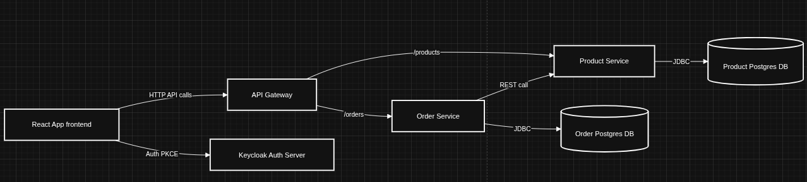

### Composants

| Composant | Port | Rôle |
|-----------|------|------|
| React Frontend | 3000 | SPA authentifié (PKCE) |
| API Gateway | 8085 | Point d'entrée, validation JWT, routage |
| Product Service | 8081 | CRUD produits (rôles: ADMIN/CLIENT) |
| Order Service | 8082 | Gestion commandes, vérification stock |
| Keycloak | 8080 | Authentification/Autorisation OAuth2 |
| Postgres (Product) | 5433 | Base données produits |
| Postgres (Order) | 5432 | Base données commandes |

---

## Fonctionnalités

- **Frontend React (SPA)**: Authentification via Keycloak (PKCE), affichage catalogue, gestion commandes
- **API Gateway**: Validation JWT centralisée, routage `(/products/**, /orders/**)`
- **Product Service**: CRUD protégé par rôles ADMIN/CLIENT
- **Order Service**: Création/consultation commandes avec vérification stock via appel REST vers Product Service
- **Sécurité**: JWT validés au niveau Gateway et services, rôles ADMIN/CLIENT, isolation données
- **Persistance**: PostgreSQL pour chaque micro-service (données persistantes)
- **Conteneurisation**: Docker Compose orchestration complète
- **DevSecOps**: Workflows GitHub Actions (CodeQL, Semgrep, ESLint, OWASP, Trivy)

---

## Diagrammes de flux

### Processus Product

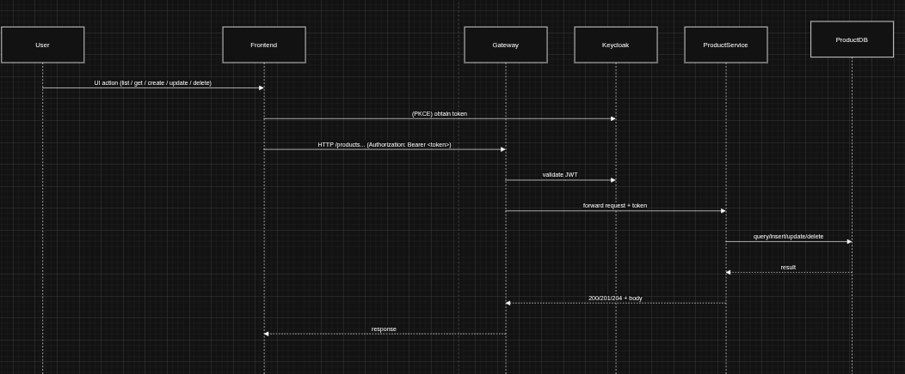

**Endpoints**:
- GET /products (ADMIN, CLIENT) - Lister tous les produits
- GET /products/{id} (ADMIN, CLIENT) - Détail produit
- POST /products (ADMIN) - Créer produit
- PUT /products/{id} (ADMIN) - Modifier produit
- DELETE /products/{id} (ADMIN) - Supprimer produit

### Processus Order

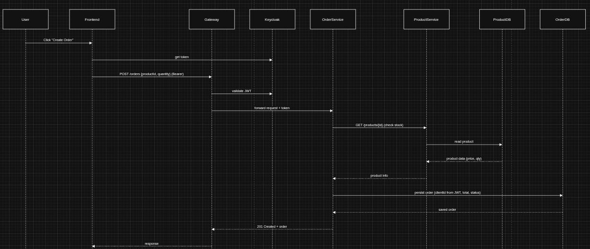

**Endpoints**:
- GET /orders (ADMIN) - Lister toutes les commandes
- GET /orders/my (CLIENT) - Mes commandes
- POST /orders (CLIENT) - Créer commande (vérification stock automatique)
- PUT /orders/{id} (ADMIN) - Modifier commande
- DELETE /orders/{id} (ADMIN) - Supprimer commande

---

## Captures d'écran - Fonctionnement

### Listing des produits

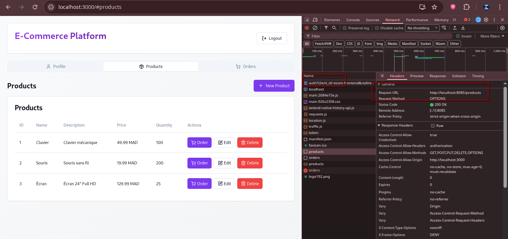

### Ajouter un produit (Admin)

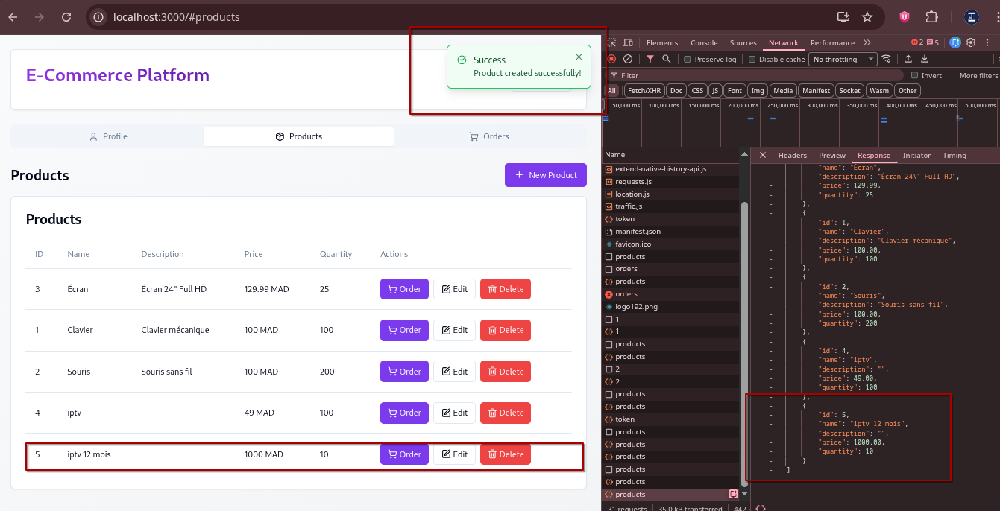

### Éditer un produit (Admin)

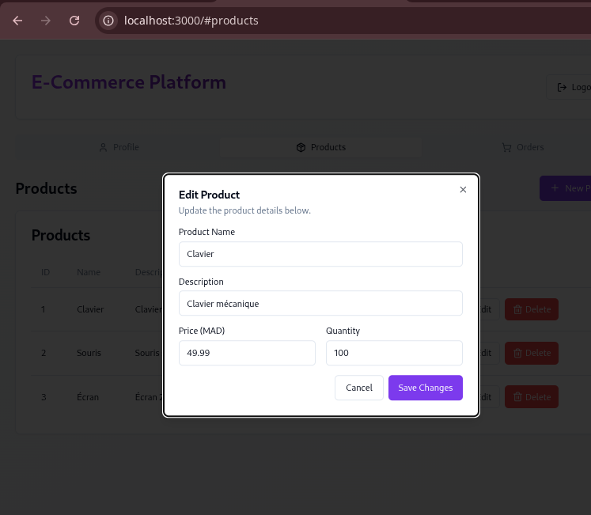


### Ajouter une commande

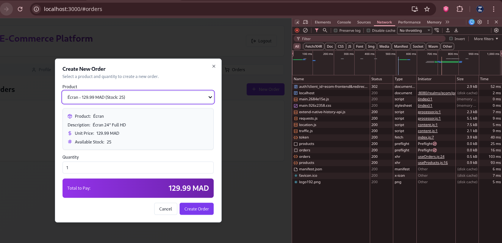

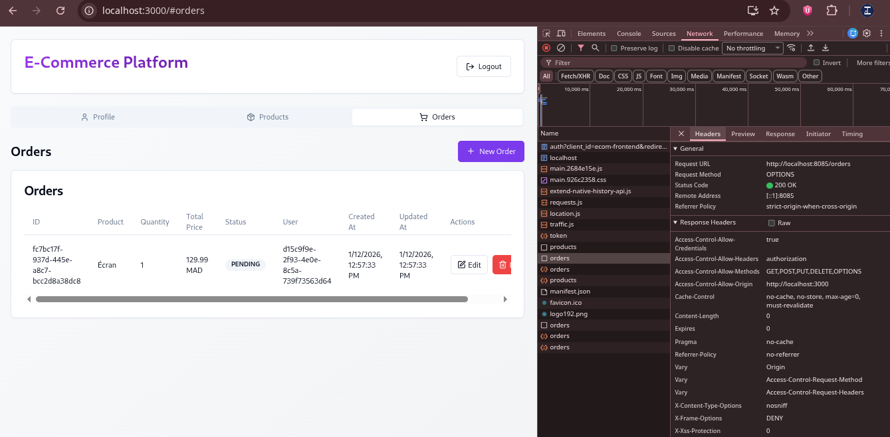

---

## Prérequis

- Java 21, Maven
- Node.js + npm
- Docker & Docker Compose

---

## Démarrage rapide (Docker Compose)

```bash
# Démarrer tous les services
docker-compose up -d --build

# Vérifier le statut
docker-compose ps

# Consulter les logs
docker-compose logs -f gateway
```

### Accès

- Frontend: http://localhost:3000
- Gateway: http://localhost:8085
- Keycloak: http://localhost:8080 (admin / admin)
- Product DB: postgresql://localhost:5433 (product / product123)
- Order DB: postgresql://localhost:5432 (order / order123)

### Arrêt et nettoyage

```bash
# Arrêter (garde les données)
docker-compose down

# Arrêter et supprimer volumes (efface tout)
docker-compose down -v
```

---

## Lancement en mode développement

```bash
# Terminal 1: Gateway (port 8085)
cd gateway && ./mvnw spring-boot:run

# Terminal 2: Product Service (port 8081)
cd product-service && ./mvnw spring-boot:run

# Terminal 3: Order Service (port 8082)
cd order-service && ./mvnw spring-boot:run

# Terminal 4: Frontend (port 3000)
cd react-app && npm ci && npm start
```

---

## Configuration Keycloak

Le realm `ecom` est importé automatiquement au démarrage depuis `ecom-realm.json`.

### Clients configurés
- **ecom-frontend** (public) - PKCE pour le SPA
- **ecom-backend** (confidential) - Usage serveur-serveur si nécessaire

### Rôles
- ADMIN - Accès complet (créer/modifier/supprimer produits et commandes)
- CLIENT - Consultation produits, création/gestion ses propres commandes

### Utilisateurs
- admin / admin (rôle ADMIN)
- client / client (rôle CLIENT)

---

## Sécurité

### Flow d'authentification

1. Frontend effectue login Keycloak (PKCE)
2. Reçoit JWT (Access Token)
3. Envoie JWT dans header `Authorization: Bearer <token>` à chaque requête
4. Gateway valide JWT et extrait rôles (`realm_access.roles`)
5. Forward requête + token aux micro-services
6. Services vérifient JWT + rôles (via `@PreAuthorize`)

### Validation JWT

- Gateway: `JwtAuthenticationConverter` + convertisseur personnalisé pour lire `realm_access.roles`
- Services: Même convertisseur pour cohérence

### Données de base persistantes

- Product DB: `keycloak-data` volume (Keycloak)
- Order DB: `order-db-data` volume
- Product DB: `product-db-data` volume

### Captures d'écran - Authentification & Autorisation

#### Architecture et flux complet

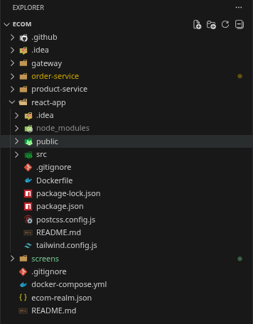

#### Client authentifié avec rôle ADMIN

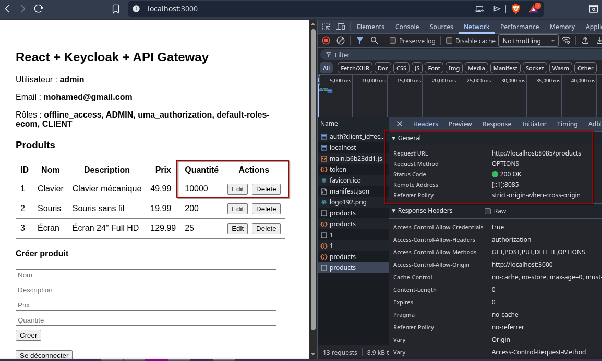

#### Opérations CRUD sécurisées via Gateway


#### Autorisation correcte au niveau Service


---

## Tests rapides (curl)

```bash
# 1. Obtenir un token via Keycloak
curl -X POST http://localhost:8080/realms/ecom/protocol/openid-connect/token \
  -H "Content-Type: application/x-www-form-urlencoded" \
  -d "client_id=ecom-backend&grant_type=password&username=admin&password=admin" \
  | jq -r '.access_token' > TOKEN.txt

# 2. Lister produits
curl -H "Authorization: Bearer $(cat TOKEN.txt)" \
  http://localhost:8085/products | jq

# 3. Créer produit (ADMIN)
curl -X POST -H "Authorization: Bearer $(cat TOKEN.txt)" \
  -H "Content-Type: application/json" \
  -d '{"name":"Laptop","description":"High-end","price":999.99,"quantity":5}' \
  http://localhost:8085/products | jq

# 4. Lister commandes
curl -H "Authorization: Bearer $(cat TOKEN.txt)" \
  http://localhost:8085/orders | jq
```

---

## Dépannage

| Problème | Solution |
|----------|----------|
| Keycloak unhealthy | Vérifier logs: `docker logs keycloak` |
| 403 sur API | Token invalide ou utilisateur sans rôle requis |
| JWT parsing error | Vérifier que `realm_access.roles` existe dans token |
| Permission denied mvnw | `chmod +x gateway/mvnw product-service/mvnw order-service/mvnw` |
| Port déjà utilisé | `docker ps` puis `docker stop <container>` |

---

## Analyse de sécurité (DevSecOps)

### Outils et workflows GitHub Actions

Workflows GitHub Actions inclus:

- **CodeQL**: Détection vulnérabilités Java/JavaScript (SAST)
- **Semgrep**: Patterns de sécurité dangereux
- **ESLint**: Qualité code React
- **OWASP Dependency-Check**: CVEs dans dépendances
- **Trivy**: Vulnérabilités images Docker

Résultats: GitHub Security Tab (onglet "Security")

### Sécurité activée dans le repo

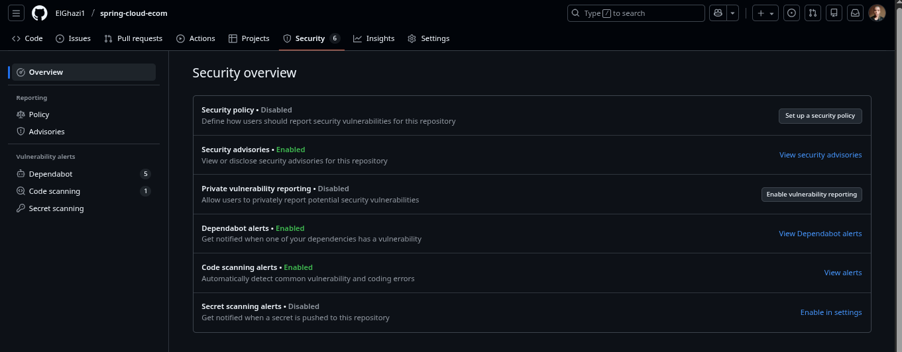

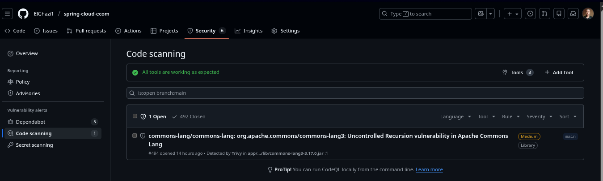

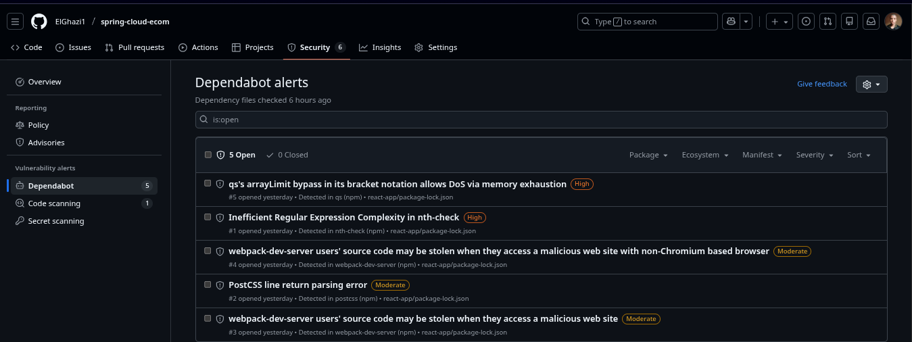

---

## Structure du projet

```
ecom/
  docker-compose.yml          # Orchestration services
  ecom-realm.json            # Export realm Keycloak
  
  gateway/                   # Spring Cloud Gateway
    src/main/java/.../config/GatewaySecurityConfig.java
    
  product-service/           # CRUD produits
    src/main/java/.../config/SecurityConfig.java
    src/main/java/.../controller/ProductController.java
    
  order-service/             # Gestion commandes
    src/main/java/.../config/SecurityConfig.java
    src/main/java/.../controller/OrderController.java
    
  react-app/                 # Frontend SPA
    src/keycloak.js
    src/hooks/useProducts.js
    src/hooks/useOrders.js
    
  screens/                   # Captures/Diagrammes
```

---

## Évolutions possibles

- Déploiement Kubernetes (Helm charts)
- mTLS inter-services
- Circuit breaker (Resilience4j)
- Caching Redis
- Monitoring ELK (Elasticsearch/Logstash/Kibana)
- Tests automatisés (JUnit, Cypress)
- API Documentation (Swagger/OpenAPI)

---

## Support et contribution

- Issues: Décrire le problème/feature demandée
- PR: Tester localement avant submission
- Security: Vérifier tokens/secrets avant push

---

## Licence

MIT
